# Week 4: Git & GitHub Advanced Challenge

## Overview

This project was completed as part of the 90 Days of DevOps challenge to gain hands-on experience with Git and GitHub workflows used in real-world software development.

The challenge covered repository management, commits, branching, pull requests, SSH authentication, and collaborative development practices.

---

## Skills Covered

* Git Fundamentals
* GitHub Repository Management
* Forking and Cloning Repositories
* Git Commits and History
* Branching Strategies
* Pull Requests
* SSH Authentication
* Collaboration Workflow
* Documentation

---

## Tools Used

* Git
* GitHub
* Linux
* SSH

---

## Project Workflow

### 1. Fork Repository

Forked the challenge repository to my GitHub account.

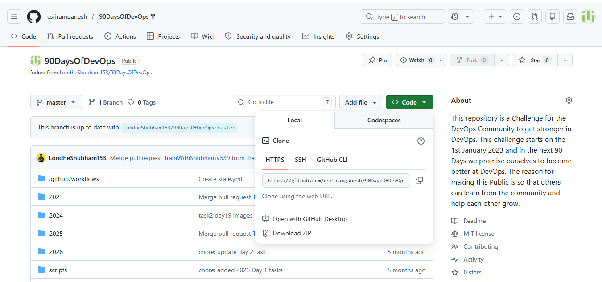

---

### 2. Clone Repository

Cloned the forked repository to my local Linux environment.

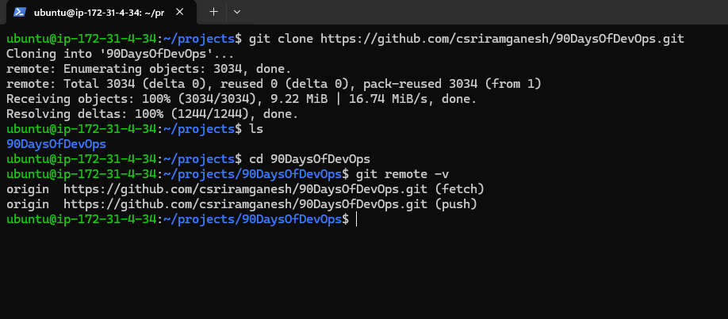

---

### 3. Create Challenge Directory

Created the Week 4 challenge directory and initialized a Git repository.

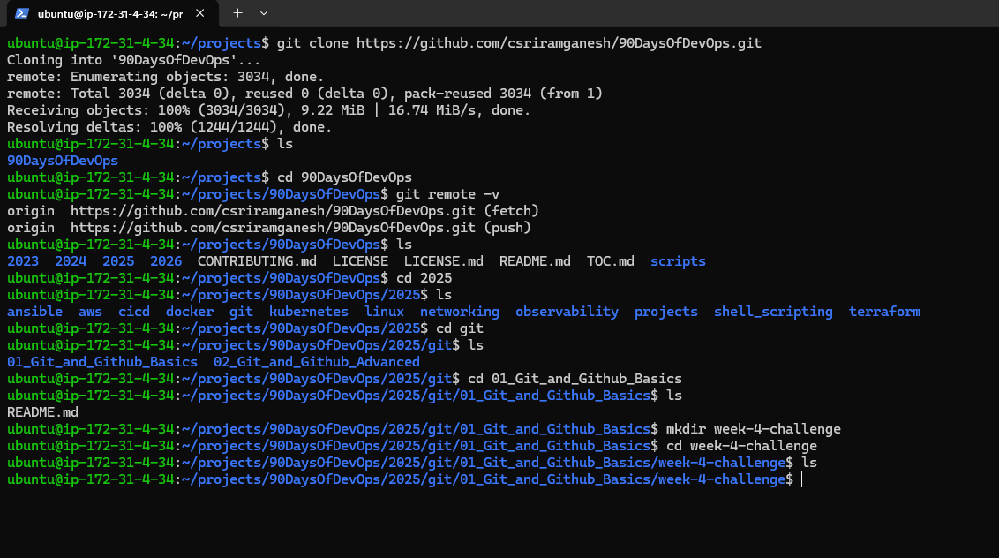

---

### 4. Create First Commit

Created `info.txt`, staged changes, and committed them to Git.

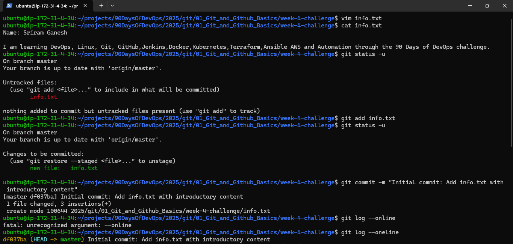

---

### 5. Push Changes to GitHub

Configured the remote repository and pushed the initial commit.

#### GitHub View

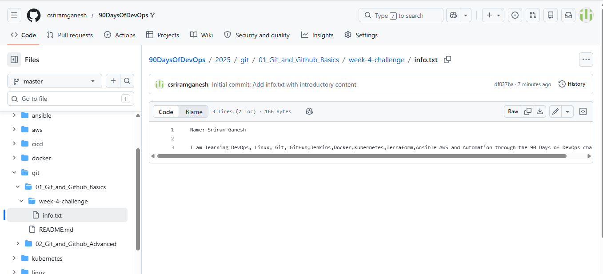

#### Terminal View

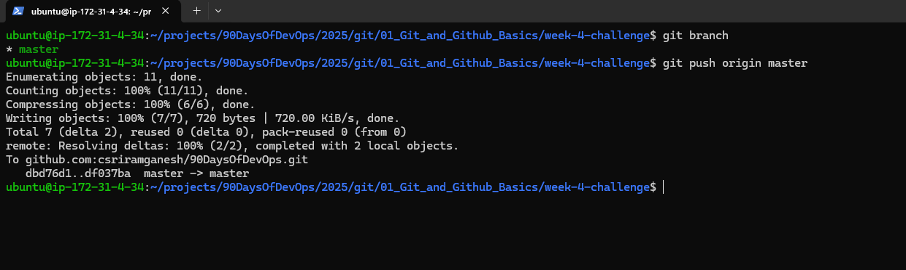

---

### 6. Explore Commit History

Used Git log commands to inspect commit history and commit hashes.

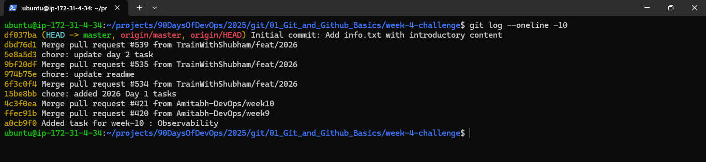

---

### 7. Create Feature Branch

Created a feature branch and performed development work separately from the main branch.

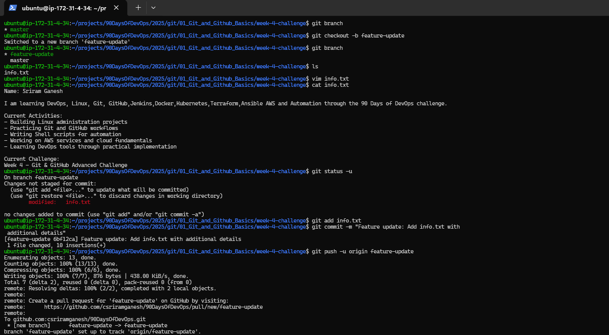

---

### 8. Create Documentation

Documented all commands, workflow steps, and branching concepts.

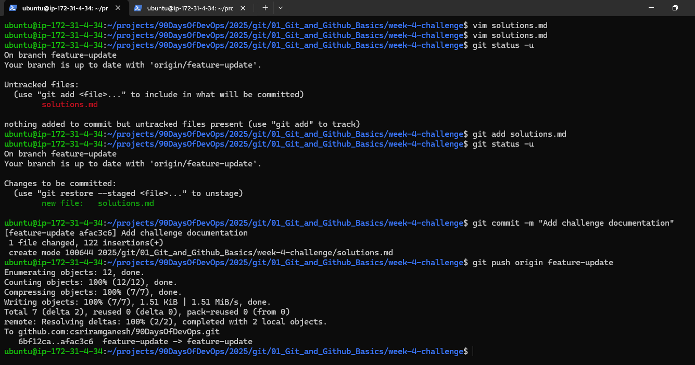

---

### 9. SSH Authentication

Verified SSH authentication and GitHub connectivity.

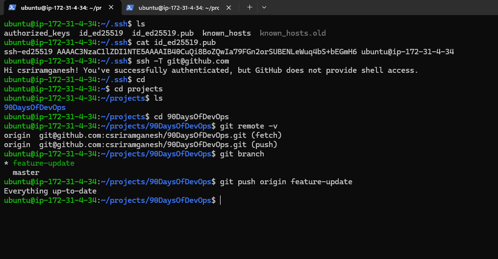

---

### 10. Pull Request Workflow

#### Create Pull Request

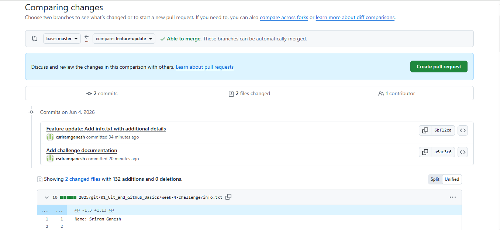

#### Review Pull Request

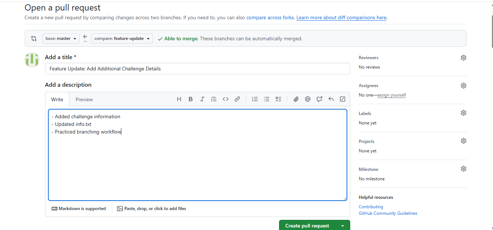

#### PR Successfully Created

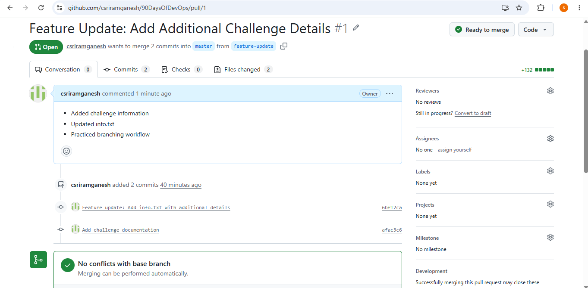

#### PR Merged

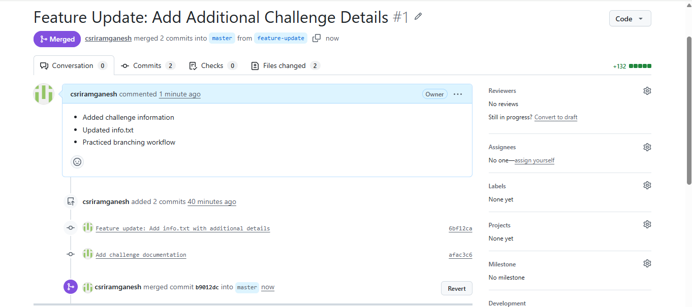

#### Local Repository Updated

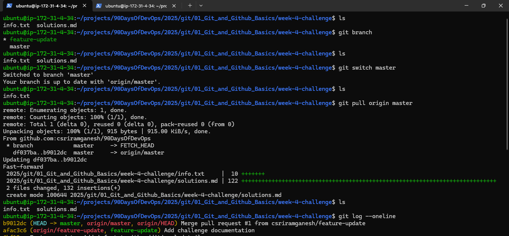

---

## Git Commands Practiced

```bash
git clone
git init
git status
git add
git commit
git push
git pull
git log
git show
git branch
git switch
git remote

ssh-keygen
ssh-add
ssh -T git@github.com
```

---

## Why Branching Strategies Matter

Branching strategies are important because they allow developers to work independently without affecting the main codebase.

### Benefits

* Isolate features and bug fixes
* Enable parallel development
* Reduce merge conflicts
* Improve code review processes
* Support team collaboration

Feature branches and Pull Requests are widely used in modern DevOps and software engineering workflows.

---

## Learning Outcomes

Through this challenge I gained practical experience with:

* Git repository management
* GitHub workflows
* Commit history tracking
* Feature branch development
* Pull Request lifecycle
* SSH authentication
* Collaborative development practices

---

## Author

**Sriram Kanni**

DevOps Engineer in Training | 90 Days of DevOps Participant
